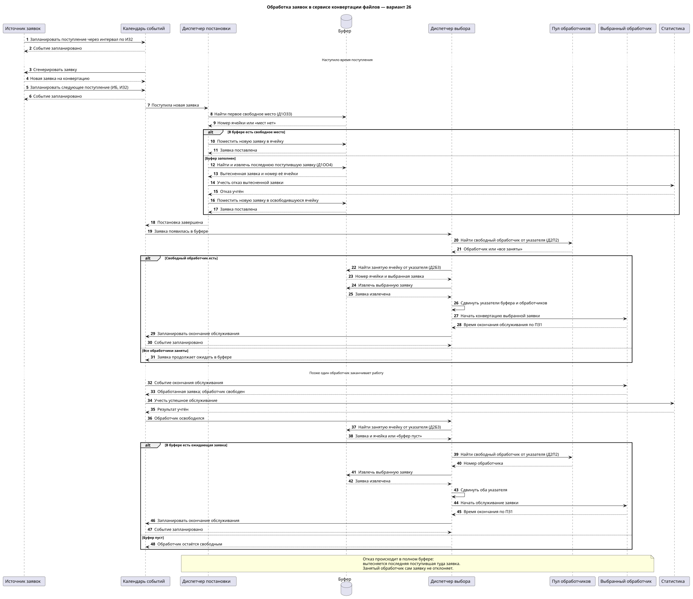
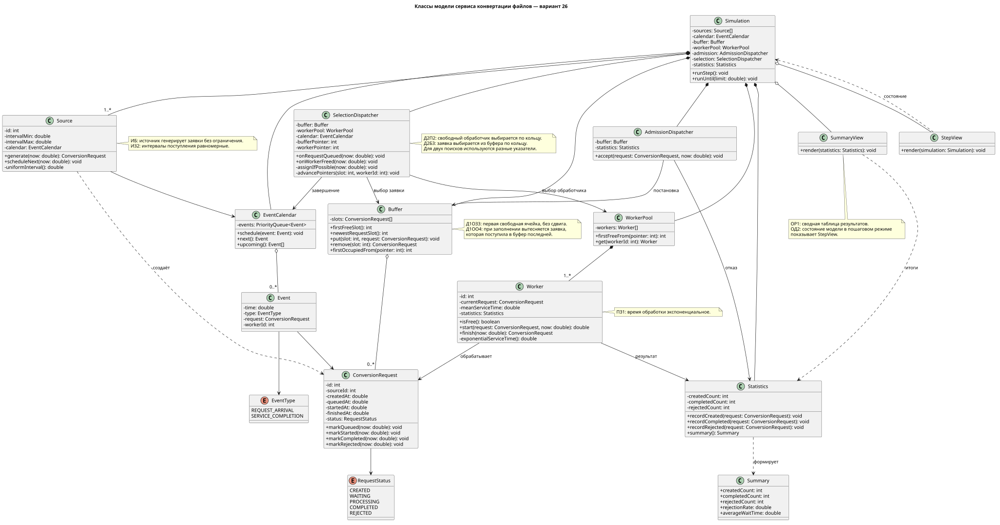
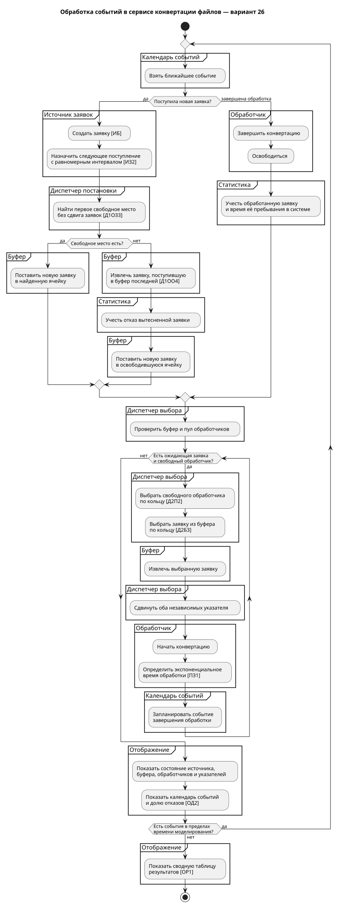

# Сервис конвертации файлов — модель СМО, вариант 26

Проект описывает имитационную модель сервиса, принимающего заявки на конвертацию файлов. Заявки поступают от пользователей, ожидают в ограниченном буфере и обрабатываются свободными процессами конвертации.

**Формула варианта:** `ИБ | ИЗ2 | ПЗ1 | Д1ОЗ3 | Д1ОО4 | Д2П2 | Д2Б3 | ОР1 | ОД2`

## Предметная область и элементы модели

| Элемент сервиса | Роль в системе массового обслуживания |
| --- | --- |
| Пользователи сервиса | Бесконечный источник заявок |
| Запрос на конвертацию | Заявка, для которой фиксируются моменты поступления, ожидания и обработки |
| Очередь ожидающих запросов | Ограниченный буфер с отдельными ячейками |
| Процесс конвертации | Обслуживающий прибор |
| Диспетчер постановки | Выбирает место в буфере и обрабатывает переполнение |
| Диспетчер выбора | Назначает ожидающую заявку свободному процессу |
| Календарь событий | Хранит моменты поступления заявок и окончания обработки |
| Статистика | Учитывает обработанные заявки, отказы и временные показатели |

Модель описывает распределение заявок и работу обработчиков. Конкретный алгоритм преобразования содержимого файла в первичные артефакты не входит.

## Расшифровка варианта

| Код | Правило |
| --- | --- |
| **ИБ** | Источник создаёт заявки без ограничения их общего числа |
| **ИЗ2** | Интервалы между поступлениями имеют равномерное распределение |
| **ПЗ1** | Время обработки заявки имеет экспоненциальное распределение |
| **Д1ОЗ3** | Заявка ставится в первую свободную ячейку буфера; другие заявки не сдвигаются |
| **Д1ОО4** | При заполнении буфера вытесняется находящаяся в нём заявка, поступившая последней; новая занимает её место |
| **Д2П2** | Свободный обработчик выбирается по кольцу |
| **Д2Б3** | Ожидающая заявка выбирается из буфера по кольцу |
| **ОР1** | Автоматический режим выводит сводную таблицу результатов |
| **ОД2** | Пошаговый режим показывает схему и текущее состояние модели |

У выбора ячейки буфера и выбора обработчика **разные циклические указатели**. Отказ учитывается при вытеснении заявки из полного буфера. Занятый обработчик заявку не отклоняет: она продолжает ждать в буфере.

## Диаграмма последовательности

Основная диаграмма показывает поступление заявки, поиск места в буфере и две альтернативы: свободная ячейка или переполнение с вытеснением заявки. Далее показаны выбор обработчика, ожидание при занятости всех обработчиков, завершение обработки и назначение следующей заявки после освобождения обработчика. Таким образом, обычный путь и краевые случаи находятся в одной диаграмме с альтернативными ветками.

[Исходник PlantUML](diagrams/system-processing-sequence-diagram.puml) · [Открыть SVG отдельно](out/file_conversion_sequence.svg)

## Диаграмма классов

| Класс | Назначение |
| --- | --- |
| `Simulation` | Управляет шагами моделирования |
| `Source` | Генерирует заявки и планирует следующее поступление |
| `ConversionRequest` | Хранит данные и состояние заявки |
| `EventCalendar`, `Event` | Хранят запланированные события |
| `Buffer` | Хранит ожидающие заявки по ячейкам |
| `AdmissionDispatcher` | Размещает заявки и учитывает вытеснение |
| `SelectionDispatcher` | Выбирает заявки и обработчиков по кольцу |
| `WorkerPool`, `Worker` | Представляют процессы конвертации |
| `Statistics`, `Summary` | Собирают и представляют результаты |
| `StepView`, `SummaryView` | Отображают состояние шага и итоговую сводку |

У диспетчеров на диаграмме указаны методы и ссылки на компоненты, с которыми они взаимодействуют.

[Исходник PlantUML](diagrams/file-conversion-class-diagram.puml) · [Открыть SVG отдельно](out/file_conversion_classes.svg)

## Блок-схема с дорожками

Дорожки показывают действия источника, календаря событий, диспетчеров, буфера, обработчика, статистики и отображения. Схема охватывает поступление заявки, переполнение буфера, окончание обработки, повторный выбор заявок и завершение моделирования.

[Исходник PlantUML](diagrams/event-processing-flowchart.puml) · [Открыть SVG отдельно](out/file_conversion_flowchart.svg)